<p align="center">
  
</p>

<p align="center">
  
  
  
  
  
  
  
  
</p>

<p align="center">
  <a href="#-возможности">Возможности</a> ·
  <a href="#-скриншоты">Скриншоты</a> ·
  <a href="#-версии">Версии</a> ·
  <a href="#-как-это-работает">Как это работает</a> ·
  <a href="#-быстрый-старт">Быстрый старт</a> ·
  <a href="#-api">API</a> ·
  <a href="#-github">GitHub</a>
</p>

**Открой Хабаровский край** — локальный туристический гид по достопримечательностям региона.
Наведите камеру на здание, памятник или природный объект: приложение узнает место по фотографии,
покажет его историю и практические советы, рассчитает маршрут с временем в пути и ответит на вопросы
через ИИ-гида, который работает без облака и отвечает только по проверенной базе знаний.

<table>
  <tr>
    <td align="center"><b>44</b><br><sub>места края</sub></td>
    <td align="center"><b>612</b><br><sub>изображений в индексе</sub></td>
    <td align="center"><b>87,4%</b><br><sub>top-1 распознавания</sub></td>
    <td align="center"><b>4,9%</b><br><sub>ложных срабатываний</sub></td>
    <td align="center"><b>65</b><br><sub>автотестов v3</sub></td>
    <td align="center"><b>0</b><br><sub>облачных сервисов</sub></td>
  </tr>
</table>

---

## ✨ Возможности

| | |
|---|---|
| 📷 **Распознавание по фото** | CLIP ViT-B/16 и FAISS сопоставляют снимок с коллекцией 44 мест, с порогами уверенности и отсечкой неуверенных ответов |
| 🗺️ **Карточки мест** | история, особенности, лучший сезон, время посещения, сложность, доступность, транспорт, что взять с собой, безопасность, этикет и источники |
| 🧭 **Маршруты** | пешком или на автомобиле: порядок остановок, время каждого перехода и осмотра, итог и диапазоны для удалённых объектов |
| 🤖 **ИИ-гид** | локальная модель Ollama отвечает по FTS5-базе знаний, называет источники и не выдумывает цены, расписания и сведения о безопасности |
| 📱 **Три интерфейса** | мобильное приложение Expo (Android/iOS/web), лёгкий веб без сборщика и Streamlit-панель администратора |
| 🔒 **Офлайн и приватно** | модель, индекс и база знаний хранятся локально; история диалога остаётся на устройстве |

## 🖼️ Скриншоты

### Веб

<p align="center">
  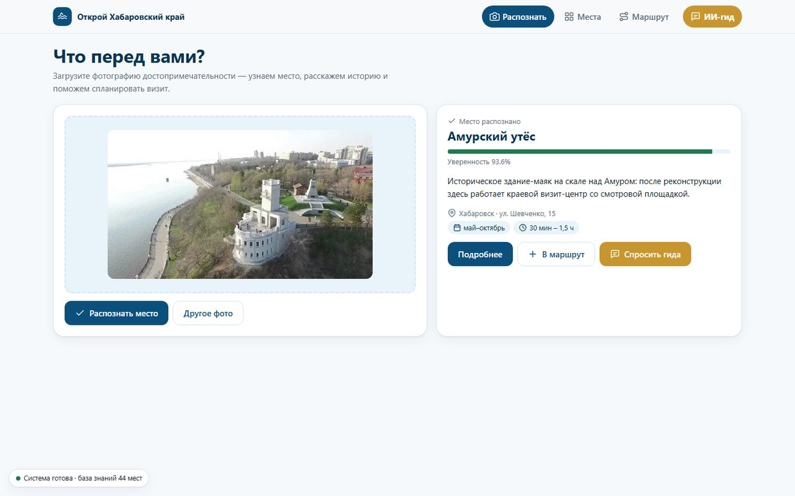
</p>

<table>
  <tr>
    <td width="50%">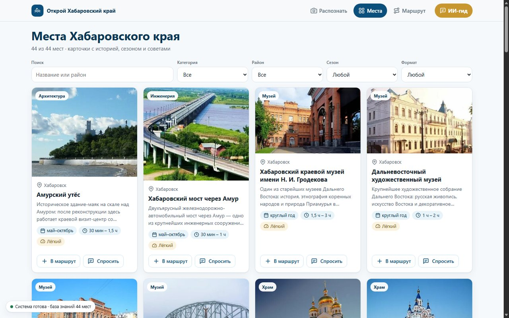<br><sub><b>Каталог</b>: фильтры по категории, району, сезону и формату поездки</sub></td>
    <td width="50%">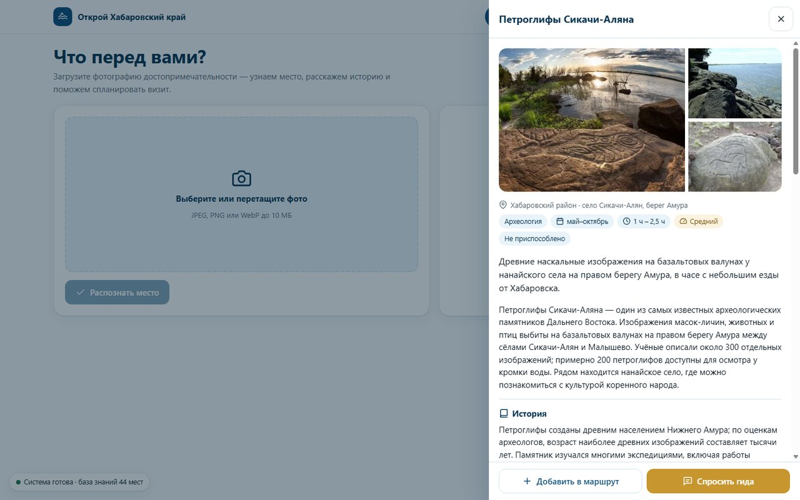<br><sub><b>Карточка места</b>: история, сезон, экипировка и источники</sub></td>
  </tr>
  <tr>
    <td width="50%">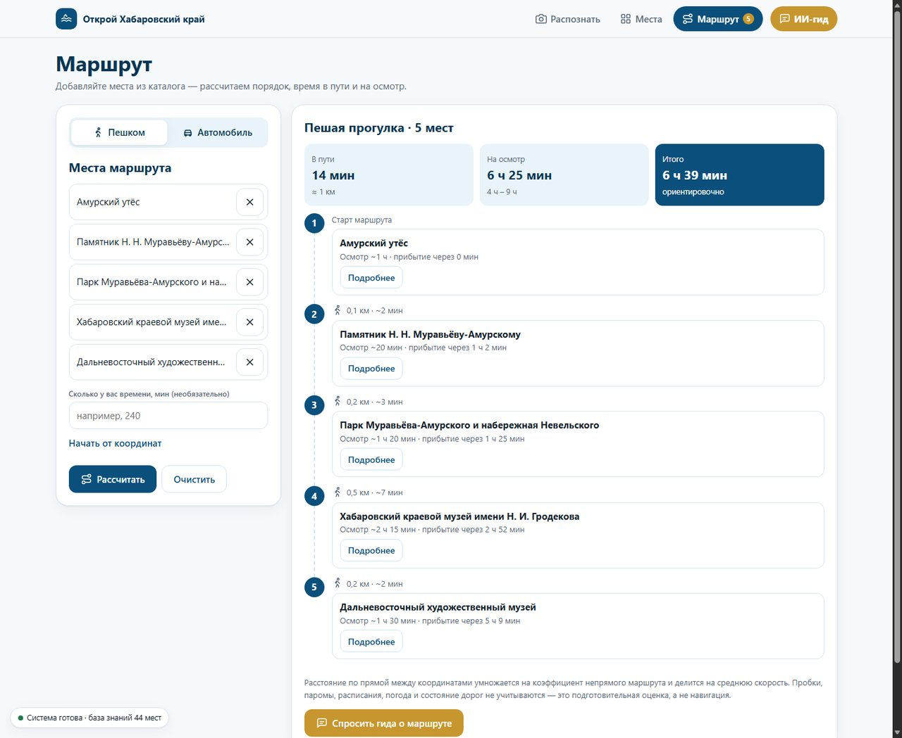<br><sub><b>Маршрут</b>: время в пути и на осмотр по каждой остановке</sub></td>
    <td width="50%">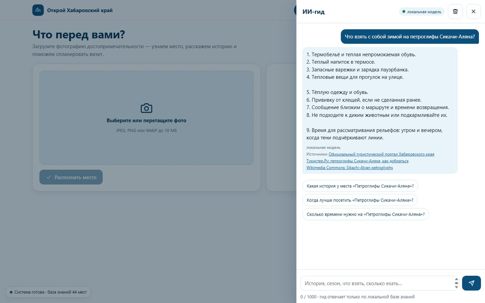<br><sub><b>ИИ-гид</b>: ответ локальной модели с источниками</sub></td>
  </tr>
</table>

### Мобильное приложение (Pixel 7, Android)

<p align="center">
  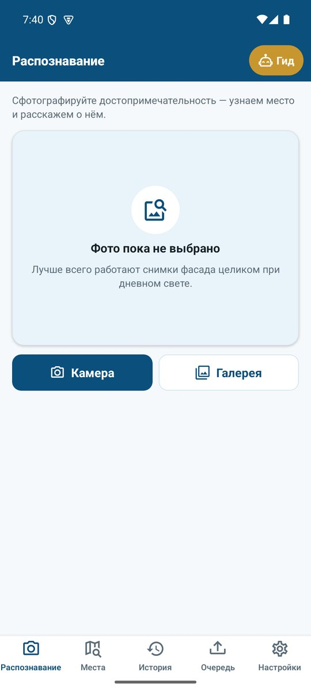
  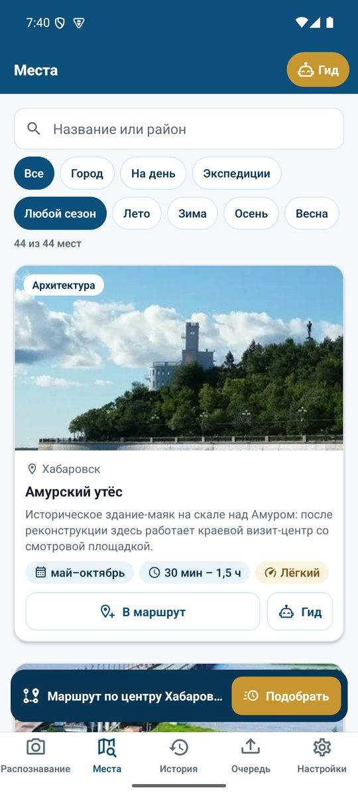
  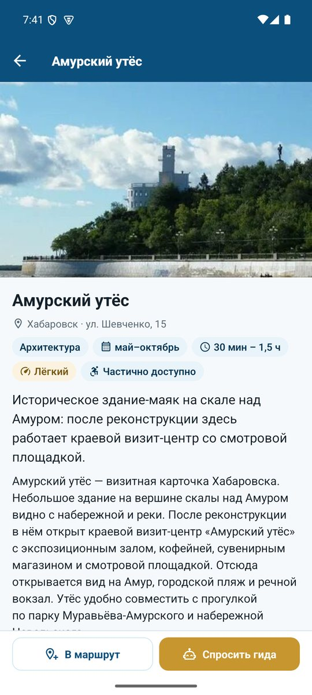
  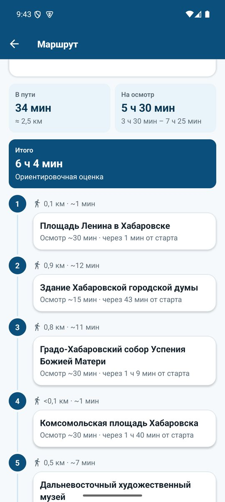
  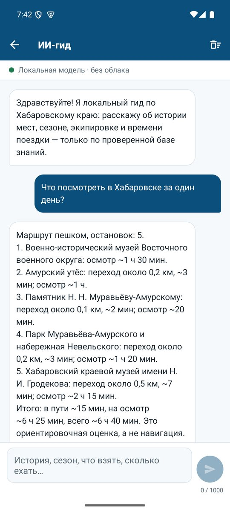
</p>

<table>
  <tr>
    <td width="30%" valign="top">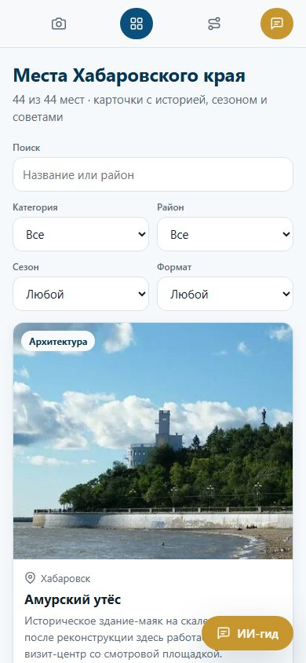<br><sub><b>Веб на 390 px</b></sub></td>
    <td width="70%" valign="top">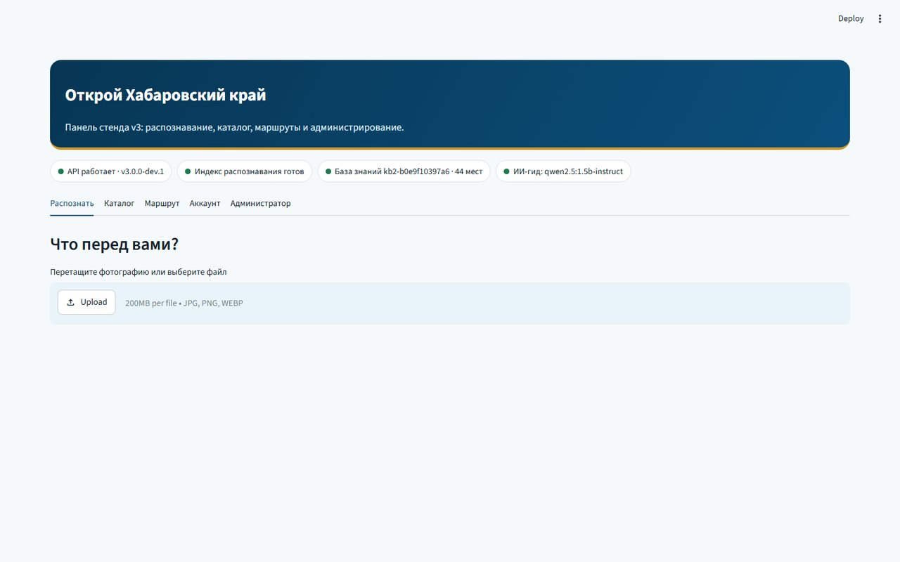<br><sub><b>Streamlit</b>: статусы API, индекса, базы знаний и гида</sub></td>
  </tr>
</table>

<details>
<summary>Интерфейс стабильной версии 2.0</summary>
<br>
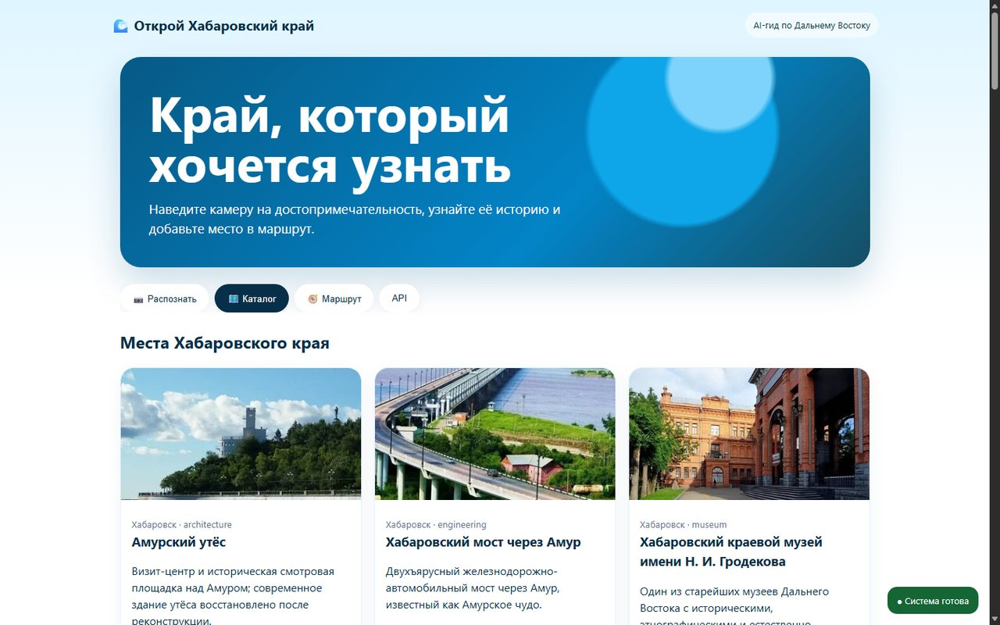
</details>

## 🏷️ Версии

| | Стабильная 2.0.0 | Версия 3.0 |
|---|---|---|
| Где | тег [`v2.0.0-demo-stable`](../../tree/v2.0.0-demo-stable), ветка `main` | ветка [`feature/v3-tour-guide`](../../tree/feature/v3-tour-guide) |
| Распознавание | ✅ CLIP + FAISS, 44 места | ✅ тот же индекс, без пересборки |
| Каталог | краткое описание | ✅ подробные карточки с источниками |
| Маршруты | ближайшие места, расстояние | ✅ время в пути, на осмотр, итог, пешком/авто |
| ИИ-гид | — | ✅ Ollama + FTS5, резервный режим без модели |
| Интерфейс | базовый | ✅ новая тема, иконки, экраны места, маршрута и гида |
| Порты (API · Streamlit · Expo) | 8000 · 8501 · 8081 | 8100 · 8601 · 8082 |

## ⚙️ Как это работает

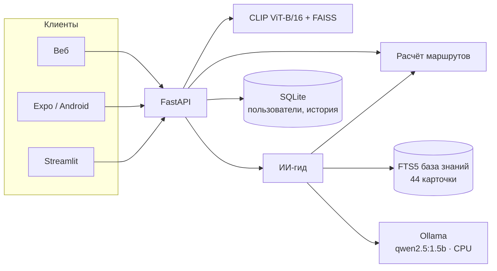

### ИИ-гид: ответ только из проверенной базы

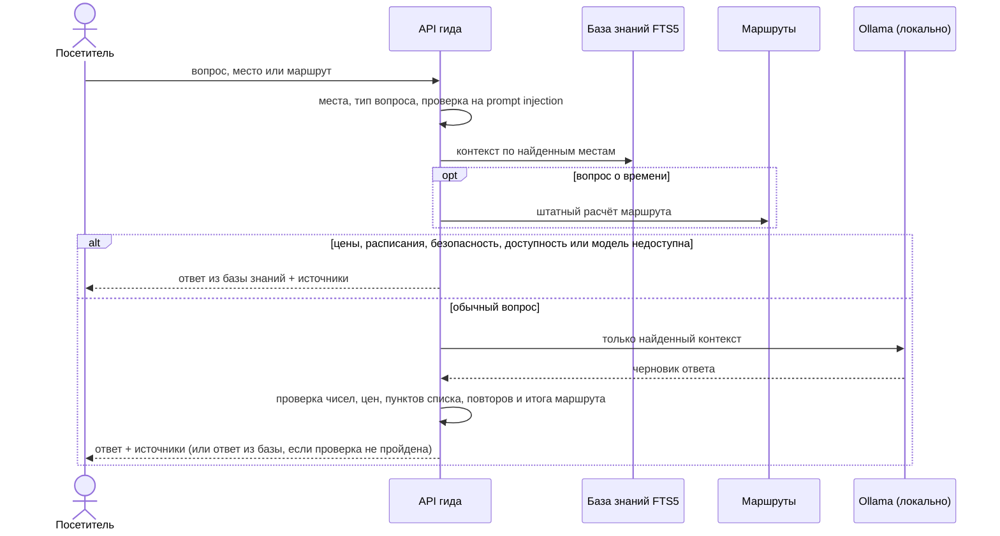

Ограничения гида: сообщение до 1000 символов, история до 8 реплик, 20 запросов в минуту на IP,
тайм-аут модели 15 с, температура 0.2, до 350 токенов.

### Качество распознавания

Leave-one-source-out проверка по 309 оригинальным фотографиям: проверяемый снимок и все его
аугментации исключаются из собственного fold.

| Метрика | Результат | Порог релиза | |
|---|---|---|---|
| Top-1 accuracy | **87,38%** | ≥ 85% | ✅ |
| Macro recall | **85,20%** | ≥ 85% | ✅ |
| False accept rate (proxy) | **4,85%** | ≤ 5% | ✅ |
| Классов с recall ≥ 70% | **39 из 44** | опубликованы в индексе | ✅ |

### Оценка времени маршрута

Расстояние по прямой × коэффициент непрямого маршрута ÷ средняя скорость. Это офлайн-оценка
для планирования, а не навигация.

| Режим | Скорость | Коэффициент |
|---|---|---|
| Пешком | 4,5 км/ч | 1,25 |
| Автомобиль в городе | 25 км/ч | 1,25 |
| Автомобиль между населёнными пунктами | 60 км/ч | 1,5 |
| Удалённые природные объекты | диапазон до ×2 | + предупреждение |

## 🚀 Быстрый старт

Нужны Windows, PowerShell и диск E (runtime, Python, кэши и модели хранятся в проекте).

**Стабильная версия 2.0**

```powershell
git clone https://github.com/maybeGILGAMESH/turism_hab.git
cd turism_hab
git checkout v2.0.0-demo-stable
PowerShell -ExecutionPolicy Bypass -File .\bootstrap.ps1
.\start-dev.ps1          # API и веб http://localhost:8000, Streamlit http://localhost:8501
```

**Версия 3.0**

```powershell
git checkout feature/v3-tour-guide
PowerShell -ExecutionPolicy Bypass -File .\bootstrap.ps1
.\scripts\install-ollama.ps1   # один раз: Ollama и модель qwen2.5:1.5b-instruct
.\start-v3.ps1 -WithExpo       # веб :8100, Streamlit :8601, Expo Web :8082
```

Без Ollama версия 3.0 тоже работает: гид отвечает детерминированно из базы знаний.
Android Emulator: `.\start-android.ps1`. Docker: `docker compose up -d` (нужен файл `.env`,
пример — `.env.example`).

### Данные и индекс

```powershell
.\collect-data.ps1        # импорт проверенного набора и аугментация index
.\build-index.ps1 auto    # индексация на CUDA при доступности, иначе на CPU
python check_index.py     # согласованность и качество
```

Исходный набор ожидается в `dataset/datasets_clear/khabarovsk_tourism_44/work/khabarovsk_tourism_44`.
`dataset/manifest.csv` — источник истины для происхождения, прав, хешей, аугментации и split.

## 🔌 API

| Метод | Путь | Назначение |
|---|---|---|
| `POST` | `/api/recognize` | распознать место по фото (JPEG, PNG, WebP до 10 МБ) |
| `GET` | `/api/objects` | каталог мест с краткими полями карточек |
| `GET` | `/api/objects/{id}` | полная карточка места *(3.0)* |
| `POST` | `/api/plan-route` | маршрут: `latitude`/`longitude` или `object_ids`, `travel_mode`, `available_minutes` |
| `POST` | `/api/assistant/chat` | вопрос ИИ-гиду *(3.0)* |
| `GET` | `/api/assistant/status` | состояние модели и базы знаний *(3.0)* |
| `POST` | `/auth/register`, `/auth/login` | регистрация и вход |
| `GET` | `/auth/me/recognized` | история распознаваний пользователя |
| `GET` | `/health` | готовность индекса, качества и базы знаний |

Интерактивная документация: `http://localhost:8000/docs` (2.0) или `http://localhost:8100/docs` (3.0).

<details>
<summary>Пример запроса к гиду</summary>

```http
POST /api/assistant/chat
Content-Type: application/json

{ "message": "Что взять с собой зимой на петроглифы Сикачи-Аляна?", "travel_mode": "walk" }
```

```json
{
  "answer": "Термобельё и тёплая непромокаемая обувь; термос с горячим напитком; ...",
  "mode": "local_llm",
  "grounded": true,
  "objects": [{ "id": 29, "name": "Петроглифы Сикачи-Аляна" }],
  "sources": [{ "title": "Официальный туристический портал Хабаровского края", "url": "https://habtravel.ru/" }],
  "warnings": [],
  "knowledge_base_version": "kb2-b0e9f10397a6"
}
```
</details>

## 🗂️ Структура

```text
app.py                 FastAPI: распознавание, каталог, маршруты, авторизация, гид
rag_searcher.py        CLIP-эмбеддинги и поиск по FAISS
build_index.py         сборка индекса и калибровка порогов
data_pipeline.py       manifest, права, split, экспорт
catalog/objects.json   44 места для распознавания
frontend.py            Streamlit-панель
static/                веб-интерфейс без сборщика
mobile-app/            Expo SDK 54
content/               карточки мест и профили (3.0)
knowledge.py           FTS5 база знаний (3.0)
routing.py             оценка времени маршрутов (3.0)
assistant.py           ИИ-гид и проверки ответов (3.0)
scripts/               окружение, Ollama, проверка backup и артефактов
tests/                 pytest
```

## 🧪 Проверки

```powershell
.venv\Scripts\python.exe -m pytest     # 65 тестов в версии 3.0
.venv\Scripts\python.exe -m ruff check .
cd mobile-app; npx expo-doctor         # 18/18
```

Тесты покрывают контракт API, авторизацию, валидацию 44 карточек, старый и новый формат маршрутов,
неизвестные и неоднозначные вопросы, prompt injection, выключенную модель, тайм-аут, выдуманные
цены и числа, лимиты и rate limit.

## 📸 Датасет и права

> **Права на фотографии оформлены.** По состоянию на 15 сентября 2026 года права на все
> фотографии датасета оформлены. Значения `pending_purchase` в `dataset/manifest.csv`
> остались от импорта: manifest входит в SHA-256-версию FAISS-индекса, поэтому статусы
> будут обновлены на `cleared` вместе со следующей пересборкой индекса.

Сами изображения, модель CLIP, FAISS-индекс, `.env`, SQLite, `.venv`, `node_modules` и
пользовательские загрузки в Git не хранятся.

## 🐙 GitHub

| Ветка / тег | Что внутри |
|---|---|
| `v2.0.0-demo-stable` | зафиксированная стабильная демо-версия 2.0.0 |
| `main` | версия 2.0.0 и актуальная документация |
| `feature/v3-tour-guide` | версия 3.0 |

<details>
<summary>Отправка изменений по HTTPS с токеном (ввод при каждом push)</summary>

1. Один раз в папке репозитория отключите сохранение учётных данных:

   ```powershell
   git config --local credential.helper ""
   ```

2. Создайте токен: **Settings → Developer settings → Personal access tokens → Fine-grained tokens →
   Generate new token**. В **Repository access** выберите только этот репозиторий, в
   **Repository permissions** выставьте **Contents** и **Workflows** в **Read and write**
   (Workflows нужен из-за `.github/workflows/ci.yml`). Токен показывается один раз.

3. Рабочий цикл:

   ```powershell
   git status
   git add .
   git commit -m "описание изменений"
   git push                     # для новой ветки: git push -u origin <ветка>
   ```

   На запрос `Username` введите логин GitHub, на запрос `Password` — токен (в PowerShell
   вставка правой кнопкой мыши, символы не отображаются).

Ошибка `Invalid username or token` означает, что вместо токена введён пароль, токен истёк или у
него нет доступа к репозиторию. Не добавляйте токен в адрес remote — он сохранится открытым
текстом в `.git/config`.
</details>
